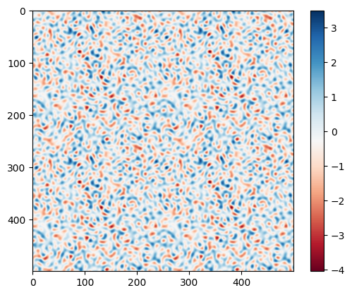

# Model Seminar SoSe2025

Topic: Hyperuniformity

Therer are hyperuniform point patterns in the point_patterns folder.
You can read a point pattern by simply using numpy.load. The shape will be (N, 2)
The parameters used for generating the point pattern are in parms.csv.

